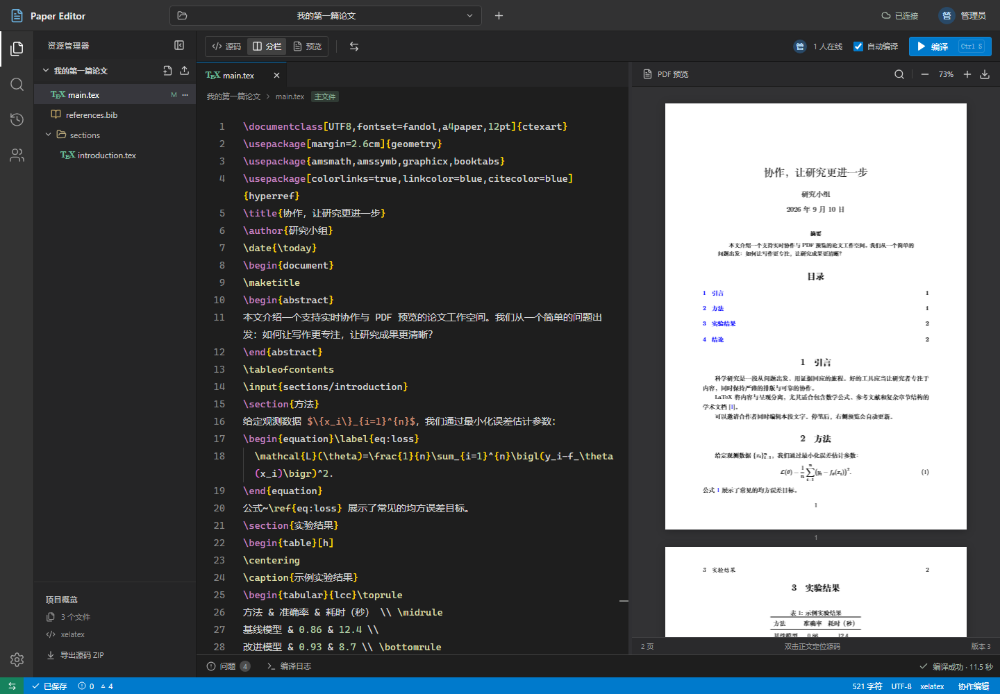

# Paper Editor

一个面向小型研究团队的 LaTeX 协作编辑器。浏览器使用 VS Code 经典深色工作台，服务端保存协作文档并编译 PDF。本机 Windows 支持 MiKTeX；Mac 部署使用 ARM 原生 TeX Live。

访问入口：[https://fblerp.com/papereditor/](https://fblerp.com/papereditor/)，使用团队管理员创建的账号登录。应用使用独立子路径，保留原 ERP 的首页和接口。



## 已实现

- Monaco LaTeX 编辑器、文件树、多标签、可拖动源码/PDF 分栏、窄屏切换。
- Yjs 实时协同、在线成员及光标、个人撤销/重做、断线草稿与重连合并。
- SQLite 持久化后才确认“已保存”；文件重命名保留协同文档 ID。
- 自动编译、手动编译与取消；每项目保留一个运行任务和一个最新待编译版本。
- XeLaTeX、pdfLaTeX、LuaLaTeX；latexmk 自动处理多轮交叉引用与 BibTeX/Biber。
- PDF 缩放、文本选择、中文搜索、下载与 SyncTeX 双向定位。
- 错误定位、实时编译日志；失败时保留上次成功预览，并提示版本差异。
- 中文/英文示例、图片上传、多文件模板、源码 ZIP 导入/导出。
- 版本快照；恢复生成新项目，保留原项目和历史。
- 账号登录、管理员创建账号、项目所有者/编辑者/只读成员、修改密码。

第一版面向 2–10 人邀请制团队；当前自动测试覆盖两名编辑者同时编辑及离线重连，没有进行长期十人压力测试。没有开放注册、邮件邀请、SSO、批注或完整历史差异视图。

## 本机启动（Windows + MiKTeX）

要求 Node.js 24 LTS、npm、Python 3 和已安装的 MiKTeX。将 MiKTeX 的 `miktex/bin/x64` 加入 PATH，并用 MiKTeX Console 预装论文所需宏包。

```powershell
npm ci
python deploy/install-perl-windows.py
Copy-Item .env.example .env
npm run build
npm start
```

打开 `http://127.0.0.1:18080`。首次启动创建示例项目，初始管理员信息写入 `.data/bootstrap-admin.json`。登录后在右上角账号设置中修改密码。这个文件、数据库、论文内容和编译产物均不会提交到 Git。

安装脚本从 Strawberry Perl 官方发行元数据下载并校验便携包，安装在 `.local/strawberry`，不会替换系统 Perl。也可以在 `.env` 的 `TEX_EXTRA_PATH` 指定已经安装的原生 Windows Perl。Git 自带的 MSYS Perl 不适合作为此项目的 Windows 编译运行时。

本地 `native` 编译只适用于可信论文。编译关闭 shell escape、禁用 MiKTeX 编译时安装器，缺包时请通过 MiKTeX Console 安装，随后重新编译。

开发模式：`npm run dev`，访问 `http://127.0.0.1:5173`。后端仍使用 18080 端口。

## 部署与设计

- [架构、编译策略与后续建议](docs/architecture.md)
- [Mac、外接盘和 FRP 部署](docs/deployment.md)
- [权限与安全边界](docs/security.md)
- [验收记录](docs/acceptance.md)

## 操作提示

`Ctrl/Cmd + S` 保存确认后编译；`Ctrl/Cmd + P` 快速打开文件；`Ctrl/Cmd + Z` 撤销自己的修改。源码工具栏的定位按钮跳到 PDF，双击 PDF 正文返回源码。新增文件时可以输入 `sections/method.tex` 创建子目录。非主文件可在标签右侧菜单重命名/删除，主文件与编译引擎在项目设置中选择。

“已保存”表示当前文档已由服务器确认持久化；“离线草稿”只表示已载入编辑器的文档可继续在当前浏览器编辑。首次访问、完整页面离线启动、离线项目/文件管理不在本版本范围内。导出 ZIP 和快照前应等待所有成员的文件显示“已保存”。

## 验证

```powershell
npm run build
npm test
npm exec playwright -- install chromium
# 先启动应用，再生成两份示例 PDF：
node deploy/check-compilation.mjs
npm run test:e2e
npm audit --registry=https://registry.npmjs.org
```

端到端测试可设置 `TEST_BASE_URL` 与 `TEST_CREDENTIALS_FILE`。浏览器工作流测试会创建一个标记为“浏览器验收项目”的测试项目。PDF 测试在尚未编译中文示例时明确跳过，不把跳过当作编译成功。

## 代码布局

```text
client/          React 工作台、Monaco 协作绑定、PDF.js 预览
server/          Fastify API、SQLite、WebSocket、编译队列
shared/          客户端/服务端协议类型
tests/           权限、协同、导入/快照与浏览器验收
deploy/          独立运行时安装、编译沙箱、LaunchAgent、验收脚本
docs/            架构与运维说明
```

第三方组件保留各自许可证。`client/pdf-text-layer.css` 来自 Mozilla PDF.js 的文本层样式，保留 Apache-2.0 声明；PDF.js 运行时资源及许可证在构建时复制到 `dist/client/pdfjs`。
