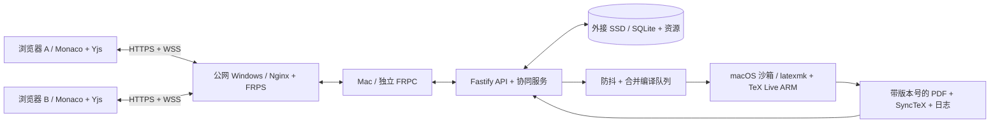

# 架构与编译方案

## 选择

第一版采用浏览器客户端 + Mac 服务端。所有成员共享一个服务端文档版本和同一套编译环境。Windows MiKTeX 用于本机启动和兼容性验证；浏览器不会直接调用另一台电脑的 MiKTeX。

### 服务端还是客户端更快？

速度取决于硬件、缓存、宏包、文件系统、编译引擎、网络和排队，不能仅凭“MiKTeX 安装在哪里”判断。

| 模式 | 优点 | 成本 |
| --- | --- | --- |
| 服务端统一编译 | 环境一致；共享缓存；用户无须安装 TeX；统一预览版本 | 需要等待服务器队列和 PDF 传输 |
| 每台客户端本地编译 | 无服务器排队；无 PDF 下载；可完全离线运行 | 每人安装维护 TeX；字体/宏包版本可能不同；浏览器需本地代理或桌面壳 |
| 混合编译 | 可为个人预览提供本地加速 | 同时维护两套同步和编译协议，必须明确哪个 PDF 是团队基准 |

在本次示例实测中，Mac M4 原生 TeX Live 完整编译英文约 1.2 秒、中文约 1.9 秒；Windows MiKTeX 对应约 9.9 秒和 11.5 秒。这不是控制变量的通用性能基准，也不包含公网下载和其他任务排队。当前环境适合服务端统一编译；后续再用真实论文测量平均值和 P95。

### “实时预览”的实际含义

文字协同即时传输；PDF 在停笔约 1 秒后排队编译。连续编辑最长约 5 秒触发一次请求。默认全局一个编译任务，每个项目最多一个运行任务和一个最新待处理任务，减少过期编译占用。编译任务读取服务端当前快照并记录项目版本；UI 对比版本，避免让旧 PDF 看起来像最新排版。

latexmk 保留项目辅助文件，以便增量编译、交叉引用和参考文献多轮处理。切换引擎/主文件/后端时清理该项目编译缓存。成功产物按构建 ID 存储，保留最近十次成功 PDF，防止覆盖正在浏览的版本。总编译日志和人工快照目前没有自动总量回收策略。

## 数据一致性

- 每个文本文件一个 Y.Doc，绑定稳定 UUID；改名不会重建协作文档。
- 服务端先在临时 Y.Doc 验证更新，再写 SQLite，成功后应用更新、广播并发送内容摘要确认。
- SQLite 使用 WAL + FULL 同步。客户端 IndexedDB 是断线草稿缓存，不能替代服务端备份。
- 二进制资源、快照和 PDF 写外接 SSD。磁盘未挂载时服务停止写入，不在系统盘创建同名替代目录。
- 项目角色同时作用于 REST 和 WebSocket。撤销项目权限会关闭该成员的协同连接。

## 适合补充的下一阶段功能

1. 外部备份和恢复演练、证书续期流程：补齐长期使用的运维条件。域名与 HTTPS/WSS 已部署。
2. 评论、审阅建议、章节级历史差异、已命名版本与模板库：补齐研究团队工作流。
3. 管理员配额、构建日志回收、队列指标、真实十人负载测试：获得可观测的容量边界。
4. Zotero/BibTeX 辅助管理、引用预览、常用宏包补全、公式片段。
5. 按项目固定 TeX 年份和字体、隔离 worker 池，提升论文结果可复现性。
6. 再考虑 Tauri/Electron、本地 MiKTeX 编译代理和完整离线启动；浏览器直接运行任意本机程序不可行。

## 设计依据

- [Yjs 协作编辑器文档](https://docs.yjs.dev/getting-started/a-collaborative-editor)介绍编辑器绑定和共享文档；本项目另行实现了服务端权限及持久化确认。
- [Yjs 离线支持](https://docs.yjs.dev/getting-started/allowing-offline-editing)说明 IndexedDB 文档缓存；本项目没有声明完整 PWA 离线能力。
- [TeX Live 2026 手册](https://tug.org/texlive/doc/texlive-en/texlive-en.html)支持便携安装，适合将本项目 TeX 目录放在外接 SSD 上。
