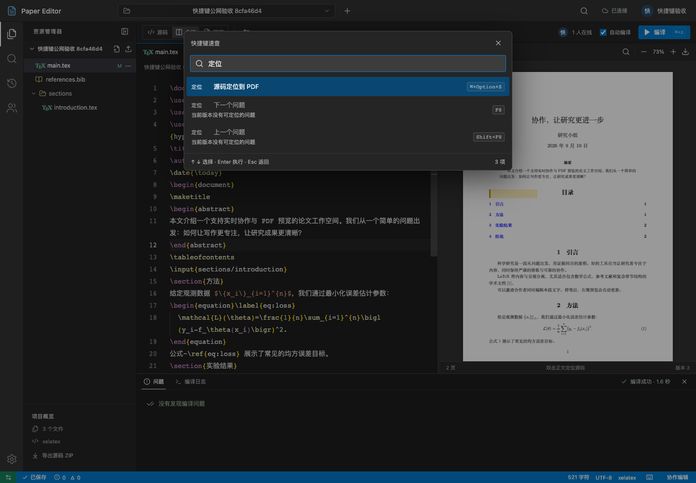

# 快捷键与命令面板

`Mod` 表示 Windows 的 Ctrl、Mac 的 Cmd；界面会自动显示对应系统的按键。先记住 **Mod+Shift+P 打开命令面板**：输入“编译”“公式”“快照”等中文，或者 build、equation、snapshot，都能找到对应操作。也可以点击顶部搜索图标。Firefox 可使用 F1。

状态栏的键盘图标打开快捷键速查。命令面板与速查均支持方向键选择、Enter 执行、Esc 返回；灰色命令会说明不可用原因。

| 操作 | 快捷键 |
| --- | --- |
| 命令面板 | Mod+Shift+P / F1 |
| 快速打开当前项目文件 | Mod+P |
| 保存确认后编译 | Mod+S / Mod+Shift+B |
| 搜索当前源码或 PDF 区域 | Mod+F |
| 项目全文搜索 | Mod+Shift+F |
| 显示／隐藏侧栏 | Mod+B |
| 显示／隐藏编译输出 | Mod + 反引号（`） |
| 源码光标定位到 PDF | Mod+Alt+S |
| 源码与 PDF 切换焦点 | Mod+Alt+V |
| 下一个／上一个有效问题 | F8 / Shift+F8 |
| 注释／取消注释 | Mod+/ |
| 撤销／重做自己的修改 | Mod+Z / Mod+Shift+Z，Windows 也支持 Ctrl+Y |
| 移动行 | Alt+↑ / Alt+↓ |
| 复制行 | Alt+Shift+↑ / Alt+Shift+↓ |
| 关闭当前浮层 | Esc |

源码编辑快捷键只在正文编辑区生效，普通表单不会触发工作区命令；中文输入法组合输入期间不会执行快捷键。浏览器关闭标签、刷新、地址栏和页面缩放保持原有用途。视图、焦点和面板操作只影响当前用户。

编译会等待服务器保存确认；长按与等待保存期间的重复请求不会重复提交。离线时仍可编辑已缓存的文档，重新连接后自动合并；离线时不能编译。编译进行中可以从面板或工具栏停止它。

PDF 返回源码使用双击正文。定位只适用于当前文档版本对应的 PDF；修改后需要重新编译。PDF 搜索中 Enter / Shift+Enter 切换匹配页，Esc 返回正文。窄屏下焦点切换会显示目标区域。

## 写作辅助

选中文字后打开命令面板，搜索并选择下面的操作。没有选区时会插入空结构并将光标放到填写位置；支持多选区，一次辅助操作可一步撤销。打开面板期间，其他成员插入文字后仍会跟踪原来的选区。

| 命令 | 结果 |
| --- | --- |
| 包裹为粗体 | `\textbf{选中文字}` |
| 包裹为斜体 | `\textit{选中文字}` |
| 插入行内公式 | `\(选中文字\)` |
| 插入独立公式 | `\[ ... \]`，正文独占一行 |
| 插入无序列表 | `itemize` 环境，每个选中非空行生成一个 `\item` |
| 插入有序列表 | `enumerate` 环境，每个选中非空行生成一个 `\item` |

辅助命令只包裹或插入，不自动去除已有命令，也不会转义原有 LaTeX。只读成员不能执行修改命令。

第一版使用固定默认按键，不提供自定义改键。新建、重命名、关闭文件、视图切换、PDF 缩放与下载、快照、项目设置和成员管理也可从命令面板访问；涉及确认的操作仍打开现有表单。

若 PDF 提示空响应或 HTTP 204，而下载接口正常，可检查 IDM 等下载工具是否接管了预览请求；将本站加入该工具的忽略列表后刷新页面。

## 换行兼容性

源码编辑统一使用 LF 换行，让 Windows 与 Mac 的协作字符位置保持一致。具有编辑权限的客户端载入含 CRLF 的旧文件时，会把换行归一为 LF；这是一次保留文字内容的协作更新，不占用个人撤销步骤，也不需要数据库迁移。更新后请刷新页面以使用同一版客户端。
